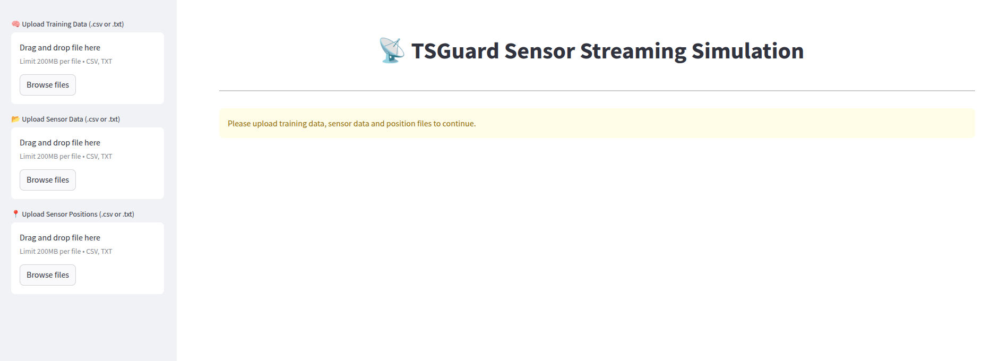
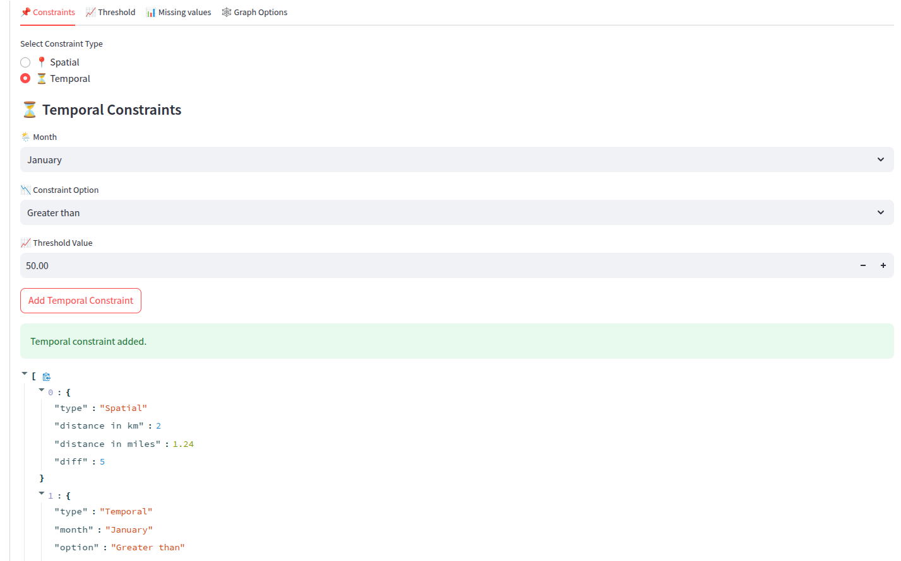
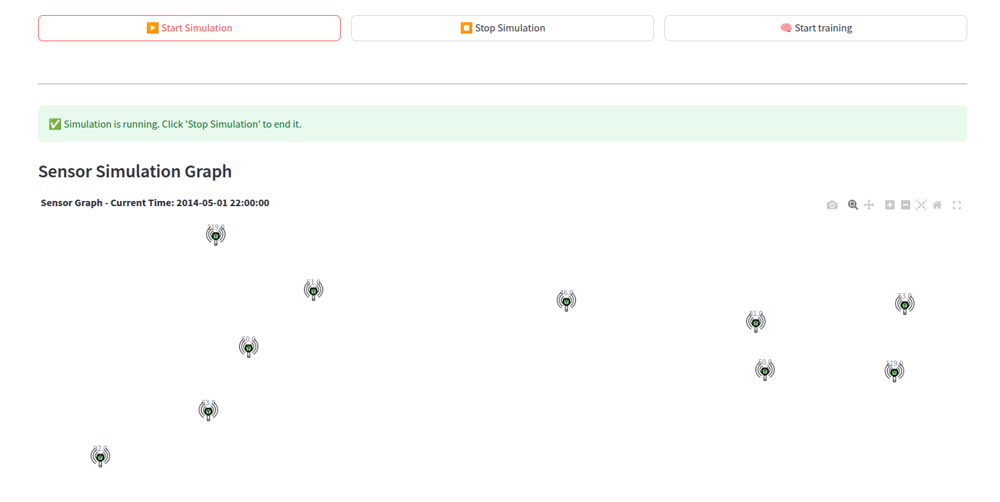
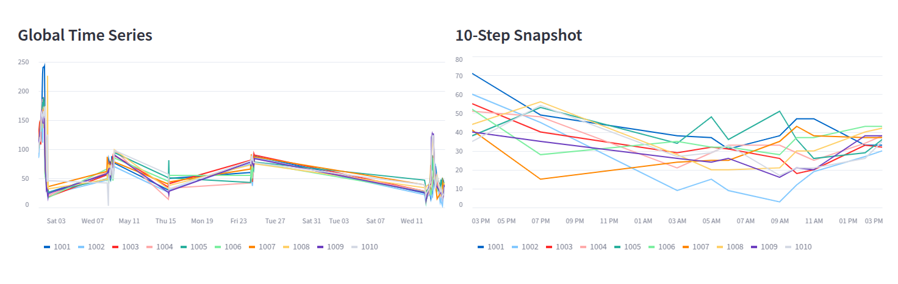

# TSGuard: Time-Series Guard for Data Imputation in Satellite Data

## 📌 Project Overview
TSGuard is an advanced AI-driven framework for imputing missing time-series data in satellite observations. It leverages Graph Neural Networks (GNNs) and statistical methods to enhance the accuracy of satellite-based environmental monitoring.

## 🛠️ Features
✅ **AI-Powered Data Imputation** - Uses GNN to predict missing values.  
✅ **Interactive Visualization** - Displays time-series data in an intuitive way.  
✅ **Simulation Capabilities** - Allows testing with synthetic datasets. 

## 📖 How It Works
TSGuard processes time-series satellite data by:
1. **Detecting missing values** 🔍
2. **Applying ML/DL imputation techniques** 📊
3. **Generating accurate reconstructions** ✅
4. **Visualizing and validating results** 📈

## 📂 Project Structure
```
TSGuard/
│-- app.py                   # Main Streamlit app
│-- requirements.txt         # Python dependencies
│-- README.md                # Project documentation
│── components/              # UI Components for Streamlit
│   ├── sidebar.py           # Sidebar controls
│   ├── settings.py          # Application settings
│   ├── buttons.py           # UI Buttons
│-- models/                  # Machine learning models and simulations
│   │-- gnn_model.py         # GNN-based model for time-series imputation
│   │-- simulation.py        # Data simulation utilities
│   │-- sim_helper.py        # Helper functions for simulations
│-- utils/                   # Utility functions
│   │-- visualization.py     # Data visualization functions
│   │-- config.py            # Configuration settings
├── images/                  # Image assets used in the application
│-- docs/screenshots/        # Screenshots for documentation
│-- data/                    # Placeholder for dataset files
```

## ✅ Prerequisites
Before running the project, ensure you have the following installed:

- **Python 3.8+**: Download from [python.org](https://www.python.org/downloads/)
- **pip**: Package manager for Python (usually comes with Python)
- **virtualenv** (Optional but recommended): For creating an isolated environment

## 🚀 Installation & Setup

### **1️⃣ Clone the Repository**
```sh
git clone https://github.com/ImaneHCN/TSGuard.git
cd TSGuard
```

### **2️⃣ Initialize and Update Submodules**

TSGUARD uses the [PriSTI](https://github.com/LMZZML/PriSTI) project as a Git submodule.  
After cloning the repository, run the following command to initialize and fetch all submodules:

```sh
git submodule update --init --recursive
```

### ** Create a Virtual Environment**
#### **Windows:**
```sh
python -m venv venv
venv\Scripts\activate
```
or
```sh
python3 -m venv venv
venv\Scripts\activate
```
#### **Mac/Linux:**
```sh
python -m venv venv
source venv/bin/activate
```
or
```sh
python3 -m venv venv
source venv/bin/activate
```

### **3️⃣ Install Dependencies**
```sh
pip install -r requirements.txt
```

## ▶️ Running the Application
```sh
python run.py
```
or
```sh
python3 run.py
```

## 📊 Screenshots
Below are some screenshots of the TSGuard interface:


*Main dashboard displaying a sidebar to uplaod training data, sensor data & positions files.*


*TSGuard configuration including:*
- **Constraints**: spatial and temporal
- **Signma Threshold**
- **Missing Values**: to define the system states.
- **Graph Size**


*Example visualization of sensors.* 


*Example visualization time-series & imputation charts.* 


*Example visualization of system state.* 

## 🤝 Contributing
We welcome contributions! Follow these steps:
1. Fork the repository
2. Create a feature branch (`git checkout -b feature-branch`)
3. Commit your changes (`git commit -m "Add feature"`)
4. Push to your fork (`git push origin feature-branch`)
5. Open a Pull Request 🎉

## 📄 License
TODO

## 📧 Contact
TODO

